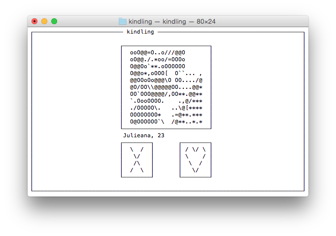
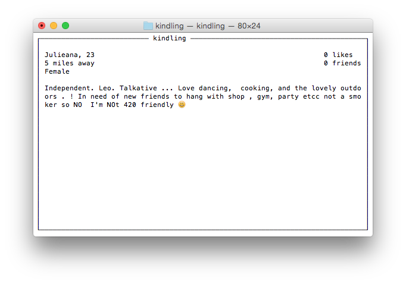
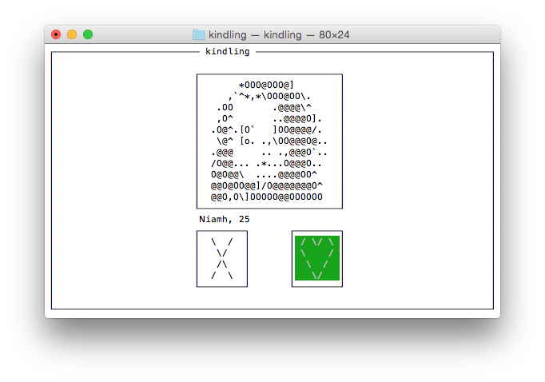
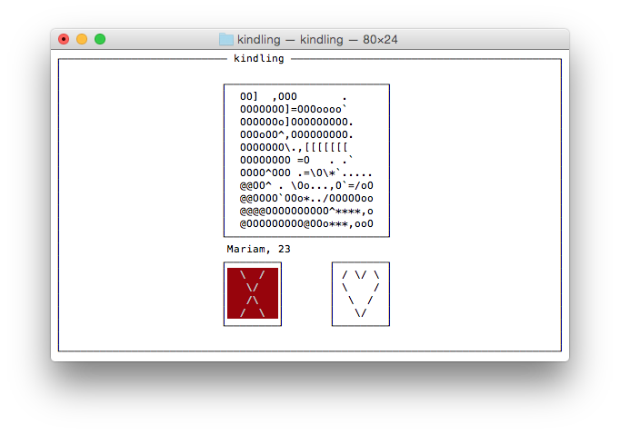

> :warning: There is no guarantee this program will work with the new/updated API.

# kindling

Tinder CLI

## Explanation

This program is a CLI (command-line interface) for Tinder. Images render as ASCII and the only functionality available is liking or passing on matches and viewing their bios.

## Installation

```bash
make && sudo make install
```

Note: depends on ncurses, jansson, libcurl, and libjpeg

## Usage

```bash
Usage: kindling [-f,--facebook_token] "<token>"
                [-a,--auth]
                [-h,--help]
```

Visit [this page](https://www.facebook.com/dialog/oauth?client_id=464891386855067&redirect_uri=https://www.facebook.com/connect/login_success.html&scope=basic_info,email,public_profile,user_about_me,user_activities,user_birthday,user_education_history,user_friends,user_interests,user_likes,user_location,user_photos,user_relationship_details&response_type=token) to retrieve the Tinder access_token. This URL is also provided by running:

```bash
kindling --auth
```

This token may be passed using the `--facebook_token` flag or placed in `~/.kindling` for easy access. Valid tokens are placed in the dotfile automatically.

## Controls

| Key           | Action         |
|---------------|----------------|
| `RIGHT ARROW` | Like match     |
| `LEFT ARROW`  | Pass match     |
| `SPACE`       | Toggle bio     |
| `q`           | Quit program   |

## Screenshots






## Acknowledgements

Shameless ripoff of [Pyre](https://github.com/zachlatta/pyre) that was developed at the [2015 Stupid Shit No One Needs & Terrible Ideas Hackathon](https://stupidhackathon.github.io/).

Also, all due credit/rights/kudos to Tinder, Inc. and the Tinder team as their private API is used in this CLI (although it's clear from working with it why it's private #inconsistency)
